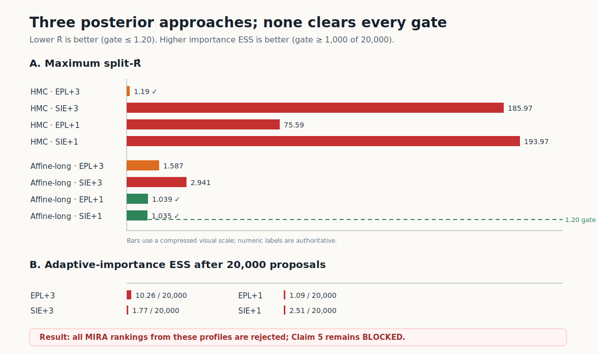

# Claim 5: three posterior approaches, three fail-closed outcomes



The campaign tested three materially different CPU posterior estimators for the
paper's four-model gravitational-lensing comparison. None satisfied its
predeclared reliability gate for all four posteriors. Although several rejected
profiles ranked the true EPL + three-Sérsic model first, those rankings are not
promoted as evidence. Claim 5 therefore remains **BLOCKED**, not VERIFIED or
FALSIFIED.

## The claim and evidence gate

The paper reports that MIRA ranks EPL + three Sérsic sources above SIE + three,
EPL + one, and SIE + one in a 13-dimensional experiment with `L=100` true
fiducials, `N=20,000` posterior samples per observation/model, 100×100 images,
unit Gaussian pixel noise, and 100 MIRA regions.

Before any full `L=100` promotion, each candidate posterior had to pass:

- finite samples and nondegenerate acceptance or weights;
- maximum split-R̂ ≤ 1.20 and minimum ESS ≥ 400 for Markov chains; or
- importance ESS ≥ 1,000 and maximum normalized weight ≤ 0.01;
- exactly 20,000 retained samples and the fixed inherited command.

The profile scale was deliberately `L=1`. It tests posterior feasibility only
and cannot itself verify or falsify Claim 5.

## What the three approaches showed

| Approach | Exact method | Diagnostic outcome | Rejected profile scores |
|---|---|---|---|
| Preconditioned HMC | Exact Metropolis-Hastings Hamiltonian trajectories; 25 chains × 800 samples; full local metric | True model passed (`R̂=1.187`, `ESS=536`), but the other three had `R̂=75.59–193.97` | 0.667, 0.532, 0.501, 0.461 |
| Affine-invariant ensemble | Goodman-Weare red/blue stretch moves; 32 walkers | Short run improved all models but failed true-model `R̂=2.289`; a 4× longer production run still failed EPL+3 (`1.587`) and SIE+3 (`2.941`) | long run: 0.671, 0.513, 0.471, 0.484 |
| Adaptive multiscale importance | 4,096-particle pilot, adapted Gaussian mixture proposal, 20,000 exact likelihood weights and resampling | Catastrophic weight collapse: ESS `10.26, 1.77, 1.09, 2.51`; max weights `0.305–0.959` | 0.627, 0.461, 0.031, 0.353 |

The long affine run retained exactly 20,000 samples after 1,000 burn-in and
2,500 production steps, thinning every fourth state. Its minimum ESS values
were all above 900 and acceptance was 0.237–0.503, yet between-walker
disagreement remained large for the two 3-Sérsic targets. This is a classic
warning that a high autocorrelation-based ESS can coexist with unresolved
modes; split-R̂ correctly prevented a false positive.

## Reproducibility and lineage

Every scientific run used HF `cpu-upgrade`, no GPU, the pinned environment, and
the exact command:

```text
uv run --frozen python repro/src/run_campaign.py
```

| Branch | Purpose | Commit | Run | Runtime |
|---|---|---|---|---:|
| [`orx/claim-5-preconditioned-hmc-posterior`](https://github.com/MachineLearning-Nerd/icml26-repro-ra2t1V4nml-mira-score/tree/orx/claim-5-preconditioned-hmc-posterior) | HMC approach | `e42145d` | `22455468-68ec-41a5-b33c-31105aedaaf7` | 29m03s |
| [`orx/claim-5-affine-ensemble-posterior`](https://github.com/MachineLearning-Nerd/icml26-repro-ra2t1V4nml-mira-score/tree/orx/claim-5-affine-ensemble-posterior) | Affine approach | `87a180b` | `aa069fc8-1c3f-4844-bfd7-cb52b96bc7c3` | 20m04s |
| [`orx/claim-5-adaptive-importance-posterior`](https://github.com/MachineLearning-Nerd/icml26-repro-ra2t1V4nml-mira-score/tree/orx/claim-5-adaptive-importance-posterior) | Importance approach | `f40d463` | `df87791a-6d5f-4de9-a71a-1ac7f158a1b2` | 4m29s |
| [`orx/claim-5-long-affine-convergence`](https://github.com/MachineLearning-Nerd/icml26-repro-ra2t1V4nml-mira-score/tree/orx/claim-5-long-affine-convergence) | Longer affine convergence test | `b26eb9a` | `cdaf1dce-41a0-48e0-9561-87a2a51881a7` | 41m11s |

All cumulative checks for Claims 1–4 and 6 passed on the long-affine branch.
The nonzero job statuses are intentional fail-closed verifier outcomes, not
environment crashes.

## Assessment

The three approaches diagnose a difficult, multimodal posterior problem:
local-metric HMC becomes trapped for misspecified models, importance weights
degenerate, and affine transitions do not mix across all 3-Sérsic modes even
after a substantial extension. None justifies a paper-scale `L=100` launch.

This evidence does **not** contradict the paper's reported ranking, because its
exact nuisance constants, posterior tensors, MALA source/tuning, and seeds are
not released. It also does not independently verify the ranking. A future
terminal result needs either those missing author inputs or a separately
validated multimodal sampler that passes the same gate before running `L=100`,
followed by paired uncertainty, independent aggregation, and a broken-pairing
negative control.

Current honest verdict: **BLOCKED**.
