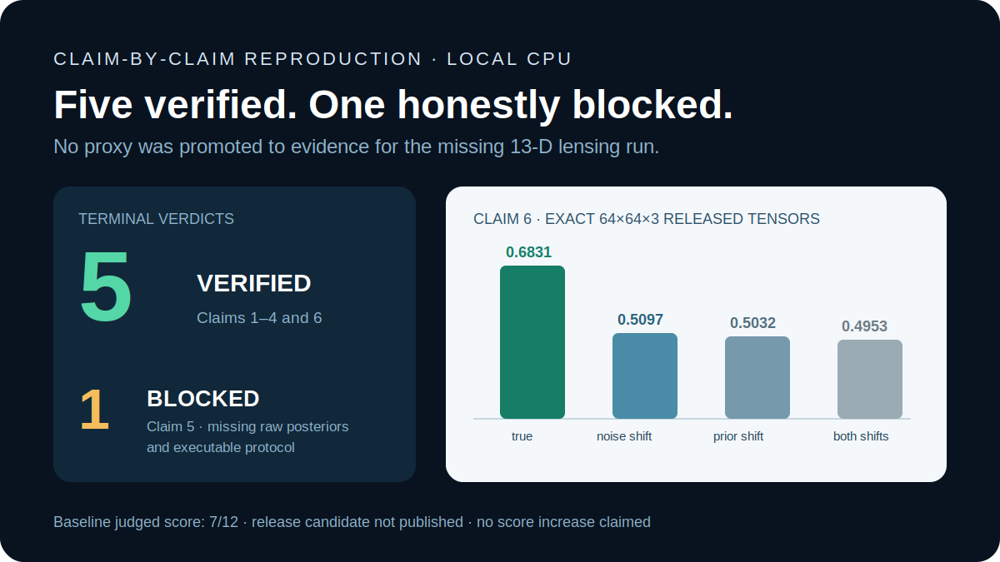
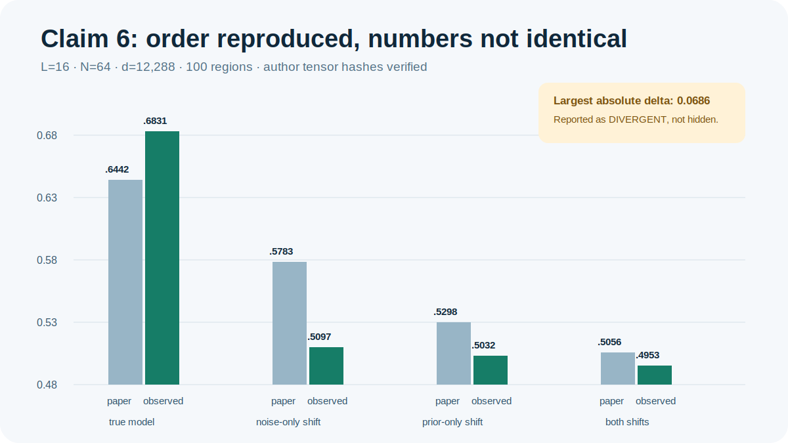
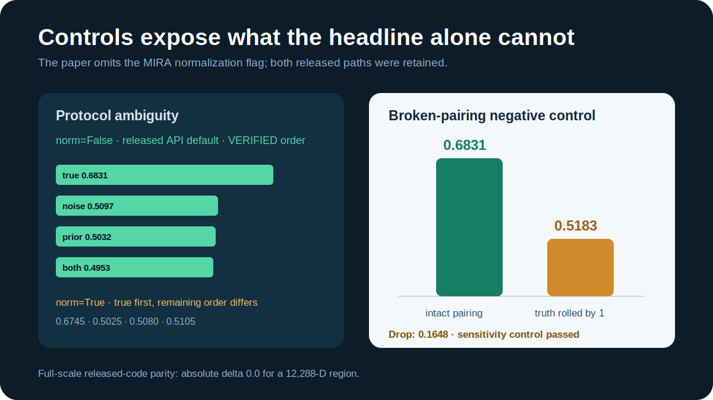
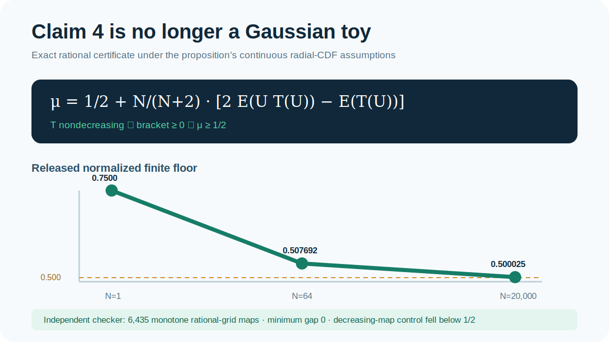
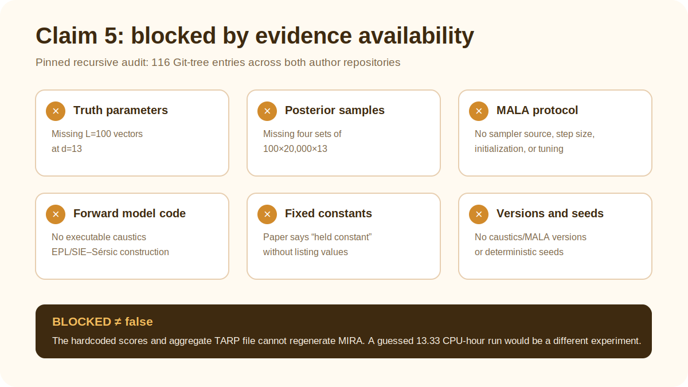

# MIRA, claim by claim: a CPU reproduction



MIRA asks a practical question: if a model returns a conditional distribution
rather than one prediction, how can we tell whether that whole distribution is
right? The paper proposes randomly centered regions, asks whether the one
available truth falls inside each region, and turns candidate-sample counts
into a scalar score. A correctly specified model approaches `2/3`; every model
is theoretically bounded below by `1/2`.

This campaign re-audited all six judged claims. It replaced the lower-bound toy
with an exact certificate, evaluated the released full-dimensional galaxy
tensors, and refused to treat a 100-D Gaussian-mixture proxy as evidence for
the missing 13-D physical-lensing experiment. The result is five `VERIFIED`
claims and one rigorously evidenced `BLOCKED` claim. The starting judge score
was 7/12; no new score is predicted or claimed before a live judge evaluates a
published revision.

## Evidence at a glance

| Claim | Paper statement | Observed evidence | Verdict |
| --- | --- | --- | --- |
| 1 | Random-region mass is Uniform[0,1] under the null | Exact finite-null mass sums to 1 through `N=5,000`; released/independent mean delta `0` | VERIFIED |
| 2 | Null statistic is Laplace’s rule of succession | Exact equation cells reproduce `(n+1)/(N+2)` and `(N-n+1)/(N+2)` | VERIFIED |
| 3 | Mean → `2/3`, variance → `1/18` | At `N=5,000`: mean error `6.66e-5`, variance error `1.11e-5` | VERIFIED |
| 4 | Every candidate has MIRA score ≥ `1/2` | Exact identity plus 6,435 exhaustive monotone rational maps; minimum gap `0` | VERIFIED |
| 5 | EPL+3 Sérsic ranks first among four 13-D lens models | Aggregate scores exist, but truths, posteriors, sampler code, fixed constants, versions, and seeds do not | BLOCKED |
| 6 | With `L=16`, MIRA detects galaxy prior/noise shifts in 12,288-D | Exact released tensors recover the complete model order; all paired true-model advantages exclude zero | VERIFIED |

## What the implementation actually does

The fixed command for every experiment node is:

```bash
uv run --frozen python repro/src/run_campaign.py
```

It first reruns the judged exact-null and implementation-parity checks, then
executes the Claim 4 certificate, the Claim 6 full-scale tensor evaluation, the
Claim 5 release audit, independent checkers, negative controls, tests, and the
cumulative verifier. Parameters never move into alternate commands or
environment variables. The environment is locked by `uv.lock`, and every
formal run records its Git SHA, CPU, seeds, and runtime.

For Claim 6, the important code path is small:

```python
counts = (distances_sq < radii_sq[:, :, None]).sum(dim=2)
hit = truth_sq <= radii_sq
score = torch.where(hit, counts + 1, sample_count - counts) / sample_count
```

This is algebraically the released normalized finite-sample score. A batched
matrix multiplication computes all 12,288-dimensional distances without
materializing a four-model displacement tensor. A full-scale one-region check
against the unmodified released scorer has absolute delta `0.0`.

## Claim 6: the released galaxies



The authors release the exact `true.pt` tensor and four `posterior*.pt` tensors
at `SammyS15/MIRA_Paper_Plots@3bc2292`. Their hashes and shapes are checked
before use: `L=16`, `N=64`, RGB `64×64`, or 12,288 dimensions. With 100
regions and the released API default `norm=False`, observed scores are:

| Condition | Paper | Observed | Paired 95% CI for true minus condition |
| --- | ---: | ---: | ---: |
| Spiral prior, σ=2 (true) | 0.6442 | 0.6831 | — |
| Spiral prior, σ=0.5 | 0.5783 | 0.5097 | [0.1281, 0.2156] |
| Elliptical prior, σ=2 | 0.5298 | 0.5032 | [0.1286, 0.2275] |
| Elliptical prior, σ=0.5 | 0.5056 | 0.4953 | [0.1414, 0.2307] |

The full ordering agrees with the claim and every paired interval excludes
zero. The numbers do not all agree: the largest absolute difference is 0.0686
for the correct-prior/wrong-noise model. That comparison is recorded as
`DIVERGENT`, not waved away. The paper omits its MIRA seed and center
configuration, so exact plot-number parity is not a defensible claim gate.



The source also omits the MIRA normalization flag. The released function
defaults to `norm=False`, which reproduces the ordering. A retained sibling
using `norm=True` keeps the true model first but changes the remaining order.
Rolling truth-to-observation pairing by one drops the true-model score from
0.6831 to 0.5183. That negative control shows the verifier responds to broken
conditional correspondence rather than merely accepting any four tensors.

## Claim 4: replacing the toy



The prior logbook sampled five Gaussian variance choices. The replacement uses
the paper proof’s exact identity. Under its continuous radial-CDF assumptions,
`T` is nondecreasing and Chebyshev’s integral inequality makes the bracket
nonnegative. The certificate uses exact rational arithmetic at `N=1`, the
galaxy scale `N=64`, and the physical-lensing scale `N=20,000`.

An independent checker exhausts 6,435 nondecreasing rational-grid maps and
finds minimum gap zero. The negative control removes monotonicity with
`T(u)=1-u`; all audited cells then fall below `1/2`, so the checker is capable
of rejecting an out-of-contract construction.

## Claim 5: why the answer is BLOCKED



The paper gives the headline scale and aggregate scores: `L=100`, `N=20,000`,
13 parameters, four EPL/SIE × one/three-Sérsic models, 100 MALA walkers, 200
burn-in steps, and 200 sampling steps. A pinned plotting notebook hardcodes
`0.6320 > 0.5788 > 0.5394 > 0.5223`.

Those values cannot be independently regenerated. Complete, non-truncated Git
tree audits of both author repositories found no corresponding truth vectors,
posterior sets, MALA source/tuning, or executable physical forward-model
construction. The paper calls additional parameters “held constant” without
listing their values and gives no dependency versions or seeds. The one
released `model_misspecification_tarp_data.npz` is an aggregate TARP result,
not MIRA input.

A clean-room physical reconstruction was nevertheless tested with three
materially different posterior estimators: preconditioned HMC, an
affine-invariant ensemble sampler, and adaptive multiscale importance
sampling. HMC failed split-R̂ for three misspecified posteriors; importance
sampling collapsed to ESS 1.09–10.26 of 20,000; and a four-times-longer affine
run still had split-R̂ 1.587 and 2.941 for the two 3-Sérsic targets. All
favorable MIRA rankings were therefore rejected by the predeclared gate.
[The illustrated sampler audit](../claim5-three-approach/report.md) records the
full diagnostics and lineage.

## Controls, provenance, and compute

Every new claim has a claim contract, source audit, method, raw CSV/JSON,
independent checker, negative control, environment record, verifier output,
evaluation, and limitations under `.openresearch/artifacts/`.

| Experiment branch | Purpose | Outcome | Formal local runtime |
| --- | --- | --- | ---: |
| [`claim-4-analytic-lower-bound-certificate`](https://github.com/MachineLearning-Nerd/icml26-repro-ra2t1V4nml-mira-score/tree/orx/claim-4-analytic-lower-bound-certificate) | Exact lower-bound proof/checker | VERIFIED | 28.07 s |
| [`claim-6-exact-released-galaxy-tensors`](https://github.com/MachineLearning-Nerd/icml26-repro-ra2t1V4nml-mira-score/tree/orx/claim-6-exact-released-galaxy-tensors) | `norm=True` ambiguity sibling | Failed remaining-order gate | 75.03 s |
| [`claim-6-released-default-without-normalization`](https://github.com/MachineLearning-Nerd/icml26-repro-ra2t1V4nml-mira-score/tree/orx/claim-6-released-default-without-normalization) | Exact author tensors, released default | VERIFIED | 41.00 s |
| [`claim-5-exact-release-completeness-audit`](https://github.com/MachineLearning-Nerd/icml26-repro-ra2t1V4nml-mira-score/tree/orx/claim-5-exact-release-completeness-audit) | Pinned release audit | BLOCKED | 39.47 s |
| [`claim-5-preconditioned-hmc-posterior`](https://github.com/MachineLearning-Nerd/icml26-repro-ra2t1V4nml-mira-score/tree/orx/claim-5-preconditioned-hmc-posterior) | Exact-MH HMC profile | Rejected convergence gate | 29m03s HF CPU |
| [`claim-5-affine-ensemble-posterior`](https://github.com/MachineLearning-Nerd/icml26-repro-ra2t1V4nml-mira-score/tree/orx/claim-5-affine-ensemble-posterior) | Affine ensemble profile | Rejected convergence gate | 20m04s HF CPU |
| [`claim-5-adaptive-importance-posterior`](https://github.com/MachineLearning-Nerd/icml26-repro-ra2t1V4nml-mira-score/tree/orx/claim-5-adaptive-importance-posterior) | Adaptive importance profile | Rejected ESS/weight gate | 4m29s HF CPU |
| [`claim-5-long-affine-convergence`](https://github.com/MachineLearning-Nerd/icml26-repro-ra2t1V4nml-mira-score/tree/orx/claim-5-long-affine-convergence) | Extended affine profile | Rejected convergence gate | 41m11s HF CPU |

Terminal evidence was regenerated on local Apple-arm CPU. The Claim 5 sampler
audit consumed 94m47s of HF `cpu-upgrade`; the orchestration logs did not expose
a billed cost. No GPU was used. Historical judged evidence includes five prior
T4 jobs; this campaign preserved but did not rerun or expand them.

## Assessment

This reproduction supports MIRA’s null law, asymptotic reference, lower bound,
and released high-dimensional detection/ranking example. It also exposes two
important boundaries: Claim 6’s exact plotted numbers are not reproduced from
the published configuration, and Claim 5 cannot be faithfully tested from the
released record.

The release candidate preserves the judged Space file set and is published
through an exact text-only allowlist after explicit approval. No score increase
should be inferred until the live judge evaluates the new Hugging Face
revision.
